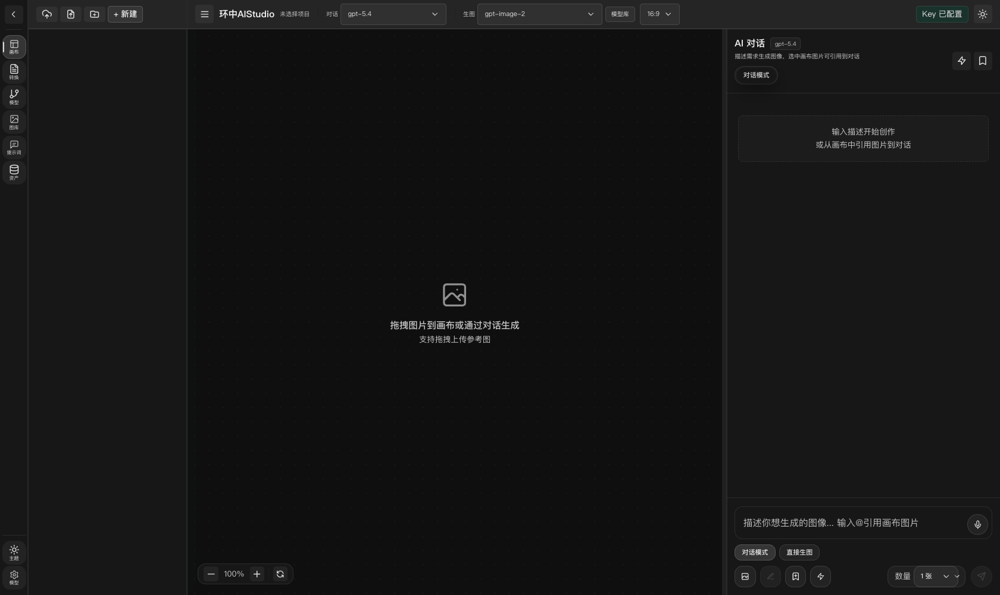

# 环中AIStudio

环中AIStudio 是一款 **AI 设计画布工具**：与 AI 对话协作，在无限画布上创建、编辑和管理图像设计。交互范式灵感来自 Lovart.ai 的 ChatCanvas。



## 功能

- **AI 对话画布**：描述需求即可生图，支持参考图引用、批量生成（1/2/4/8/16 张）、多模型对话
- **无限画布**：拖拽/缩放/框选/多选、图片工具（扩图/去背/高清/分层/抠图）、画板整理、快捷键
- **作品图库**：分页 + 服务端 WebP 缩略图，千张级流畅；标签/收藏/多视图/筛选/批量下载/回收站
- **模型中心**：多供应商接入（gr sai / 云雾 / Codia / 自定义 OpenAI 兼容端点），模型表格列可调、说明悬浮查看
- **提示词资产平台**：提示词库、原子词、组合包、业务模板、分类、测试与版本管理
- **项目管理**：项目列表/文件夹、云同步中心（NAS / 本地目录）、项目导入导出与备份
- **桌面体验**：多显示器/多分辨率自动缩放（`⌘/Ctrl +/-` 可手动微调）、深色/浅色主题、本地优先存储

## 下载安装

最新版本见 [GitHub Releases](https://github.com/congrongdesign/huanzon-aistudio/releases)。

| 平台 | 安装包 |
| --- | --- |
| macOS Apple Silicon | `环中AIStudio-<version>-arm64.dmg` / `.zip` |
| macOS Intel | `环中AIStudio-<version>-x64.dmg` / `.zip` |
| Windows x64 | `环中AIStudio-<version>-win-x64-setup.exe`（安装版）<br>`环中AIStudio-<version>-win-x64-portable.exe`（免安装） |
| 源码 | `环中AIStudio-<version>-source.tar.gz` |

所有安装包附带 `SHA256SUMS.txt` 校验。

> **未签名说明**：本软件未使用正式代码签名证书，macOS 首次打开会出现 Gatekeeper 提示、Windows 会出现 SmartScreen 提示，均属正常。
> - macOS：右键应用 → 打开；或 系统设置 → 隐私与安全性 → 仍要打开
> - Windows：更多信息 → 仍要运行

首次使用请在“模型中心”配置 Base URL 与 API Key（gr sai / 云雾 / Codia 或任意 OpenAI 兼容接口）。

## 本地开发

仅使用 pnpm：

```bash
pnpm install
pnpm dev        # 启动 Next.js 开发服务器
pnpm electron:dev  # 启动 Electron 桌面调试
```

常用命令：

```bash
pnpm run validate         # 类型检查 + lint
pnpm run desktop:release  # 打包发布（mac + win）
pnpm run desktop:verify   # 校验发布产物
```

## 数据与隐私

- 默认**本地存储**，不强制上传云端：数据目录位于系统应用数据目录（`~/Library/Application Support/环中AIStudio`）
- 可通过“云同步中心”把项目包同步到 NAS / 本地目录，多机共享
- 可选 Supabase 云模式（默认关闭）

## 技术栈

Next.js 16 · React 19 · TypeScript · shadcn/ui · Tailwind CSS 4 · Electron · Supabase（可选）· coze-coding-dev-sdk

## 许可

MIT
