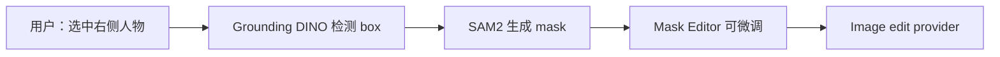
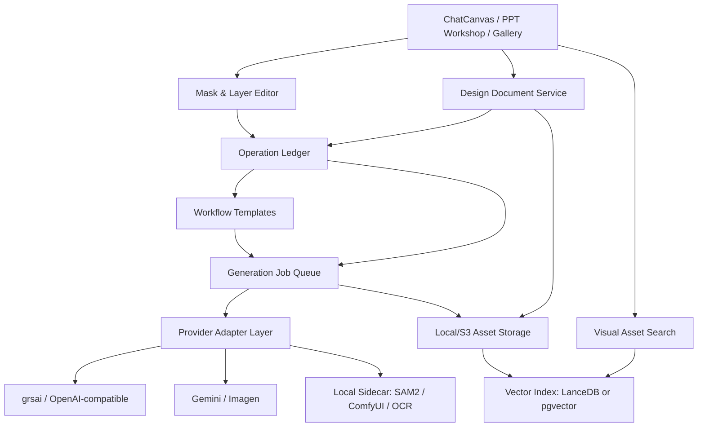

# AI 设计平台前沿技术调研与优化方案

日期：2026-06-12

## 1. 结论摘要

平台下一阶段不建议继续堆“更多模型按钮”，而应该升级为“可控、可回退、可复用、可检索、可交付”的 AI 设计生产系统。

优先级建议：

1. P0：建立非破坏式编辑底座。所有生成、扩图、局部重绘、去背、高清、分层都记录为 operation，不覆盖原图。
2. P0：强化局部蒙版精修。画笔/橡皮擦/反选/前后对比/回退，是最快提升专业感的功能。
3. P1：接入智能选区。SAM2 + Grounding DINO + Florence-2 可以把“用户画 mask”升级为“点一下主体/输入物体名自动选区”。
4. P1：做视觉资产检索。用 SigLIP2/CLIP/ColPali + LanceDB/pgvector，把图库、参考图、PPT 页面、知识库变成“能搜风格和构图”的资产系统。
5. P1：做文字与版式增强。中文海报、PPT、封面图的核心痛点是文字准确、层级和排版，建议引入 Qwen-Image/AnyText/DesignDiffusion 思路。
6. P2：做 Layer Lite。先实现主体层、背景层、文字区域、装饰层、mask 层，不急于完整 PSD。
7. P2：做工作流复用。参考 ComfyUI/InvokeAI，但不要把复杂节点图暴露给普通用户，做“线性工作流模板 + 高级节点视图”。
8. P3：扩展到视频/动效。先做 storyboard、分镜图、关键帧一致性，再接视频生成。

明确不做：多模型对比面板。本阶段按用户要求移除。

## 2. 当前平台能力判断

从当前代码结构看，平台已经具备较完整的 AI 设计基础：

- 主画布：`src/app/page.tsx`
- 生图：`src/app/api/generate/route.ts`
- 局部重绘：`src/app/api/inpaint/route.ts`
- 图像处理：`src/app/api/image-process/route.ts`
- 历史图库：`src/app/api/history/route.ts`
- 灵感/参考图库：`src/app/api/inspiration/*`、`src/app/api/references/route.ts`
- 提示词资产：`src/app/api/prompt-*`
- PPT 工作台：`src/components/PPTWorkshop.tsx`
- 案例/风格包：`src/components/AssetCollectionsPanel.tsx`
- 知识库/云同步：`src/app/api/knowledge-hub/*`、`src/app/api/cloud-sync/route.ts`

核心短板：

- 图像仍以 `CanvasImage` 扁平记录为主，缺少资产、图层、版本、操作链。
- 已有 inpaint 能力，但还没有产品化成完整的“局部精修工作台”。
- 去背/高清/扩图/分层等工具是动作按钮，不是可追踪的设计操作。
- 图库强在存储和筛选，弱在语义检索、风格检索、相似图检索。
- PPT 工作台与主画布/风格包/知识库之间还没有形成统一资产流。
- 生成结果缺少质量评估、文字准确率检查、品牌一致性评分和交付报告。

## 3. 技术雷达

| 方向 | 代表论文/项目 | 可落地价值 | 建议优先级 |
|---|---|---|---|
| 局部编辑 | OpenAI Image edits, Gemini image editing, BrushNet, MGIE, Step1X-Edit | 局部替换、修物体、改材质、改文字区域 | P0 |
| 智能选区 | SAM2, Grounding DINO, Florence-2 | 点击主体、框选物体、按文字选区、自动 mask | P1 |
| 图层化 | LayerDiffuse, LayerD, DiffDecompose, OmniPSD, Qwen-Image-Layered | 主体/背景/文字/装饰层，非破坏式编辑 | P1/P2 |
| 文字生成 | Qwen-Image, AnyText, GlyphDraw, TextDiffuser-2, DesignDiffusion | 中文标题、海报字、PPT 封面文字准确 | P1 |
| 版式规划 | LayoutGPT, Graphist, AesthetiQ, Sketch-to-Layout, CreatiPoster | 从素材和文案自动排版，草图到设计 | P1/P2 |
| 视觉检索 | SigLIP2, ColPali, LanceDB, CLIP family | 搜风格、搜构图、搜相似 PPT 页面 | P1 |
| 一致性 | IP-Adapter, InstantID, DreamBooth/LoRA | 品牌、产品、角色、场景一致性 | P2 |
| 光照/深度 | IC-Light, Depth Anything V2, ControlNet | 合成更自然，换背景后统一光感 | P2 |
| 工作流 | ComfyUI, InvokeAI Workflows, MCP | 一键复用、批量生产、外部工具连接 | P2 |
| 视频/动效 | SAM2 video, Movie Gen, Runway Gen-4 references | 分镜、关键帧、角色一致动效 | P3 |

## 4. 重点论文与项目可用性

### 4.1 局部编辑与指令编辑

**OpenAI Image API / Gemini Image API**

- OpenAI Image API 支持生成、编辑、参考图和 mask 局部编辑。
- Gemini 图像 API 支持 text-and-image-to-image、多轮图像编辑。
- 平台已有 grsai/OpenAI 兼容代理，最短路径是把 mask 编辑规范化为统一 `ImageEditProvider`。

可落地功能：

- “只改这里”：上传原图 + mask + prompt。
- “保留主体，只换背景”：自动主体 mask + 背景编辑。
- “把这块文字改成 XXX”：文字区域 mask + 文字渲染模型/后处理。
- “局部风格迁移”：对选区套用风格包。

**MGIE**

MGIE 的关键启发不是直接换模型，而是“先用多模态大模型把用户短指令扩写成明确编辑指令，再交给图像编辑模型”。这很适合你当前对话式产品。

建议实现：

- `edit_intent_expander`：输入原图摘要、用户指令、选区信息，输出结构化编辑 intent。
- 输出字段：`target_area`、`keep_constraints`、`change_constraints`、`negative_prompt`、`quality_checks`。

**BrushNet / Step1X-Edit / OmniGen2**

这些模型说明趋势是“一套模型处理生成、编辑、参考图和上下文生成”。平台不一定要本地部署，但接口层应该抽象为统一能力：

```ts
type ImageOperationKind =
  | "generate"
  | "edit_mask"
  | "edit_instruction"
  | "outpaint"
  | "remove_bg"
  | "upscale"
  | "split_layers"
  | "relight"
  | "text_render";
```

### 4.2 智能选区

**SAM2**

SAM2 是目前最值得接入的本地视觉能力之一。它能通过点、框、mask prompt 对图像和视频做分割，并支持视频跟踪。对你平台的价值很直接：

- 一键选中主体。
- 一键选中文字区域/产品/人物/背景。
- 自动生成 inpaint mask。
- 后续视频关键帧编辑可沿用同一选区。

**Grounding DINO**

Grounding DINO 适合“文字找物体”：用户输入“选中杯子”“选中右边人物”，先检测 box，再交给 SAM2 出 mask。

**Florence-2**

Florence-2 可做 caption、OCR、目标检测、grounding 等多任务。适合做轻量视觉理解：

- 自动生成图片标题和标签。
- 识别图片里有哪些可编辑对象。
- 给 Agent 提供画布图像语义摘要。

建议链路：



### 4.3 图层化与可编辑设计

**LayerDiffuse**

LayerDiffuse 的核心价值是“原生透明图层生成”，不是生成后再抠图。它适合做：

- 透明 PNG 素材生成。
- 前景主体、背景分离。
- 风格包里的装饰元素生成。

**LayerD / DiffDecompose / OmniPSD**

这些研究方向说明“从扁平设计图还原图层”会成为设计工具核心能力。现阶段不要追求完整 PSD，但可以做 Layer Lite：

- `background`
- `subject`
- `text_region`
- `decor`
- `mask`
- `reference`

第一阶段用传统 CV + SAM2 + OCR + 去背组合；研究模型成熟后再替换。

### 4.4 文字和版式

**Qwen-Image / AnyText / TextDiffuser-2 / DesignDiffusion**

你的平台面向中文设计、PPT、海报和商业图，文字准确率会决定可用性。普通图像模型经常在中文、数字、标题、品牌字上失败。

建议新增“文字严格模式”：

- 用户输入标题、副标题、卖点、日期、品牌名。
- 系统不让图像模型自由发挥文字。
- 先生成无文字/弱文字背景。
- 再用浏览器 SVG/Canvas 或 PPT 文本层叠加准确文字。
- 如果必须图像内融合文字，再走 Qwen-Image/AnyText 类模型。

可落地功能：

- 标题安全区。
- 一键生成 3 套标题排版。
- OCR 校验生成图文字。
- 中文错字自动红标。
- PPT 页面文字 100% 保护。

### 4.5 版式规划

**LayoutGPT / Graphist / AesthetiQ / Sketch-to-Layout**

这些论文的共同启发：不要直接让图像模型“猜”版式，应该先生成 layout spec，再渲染/生成。

建议平台引入中间表示：

```json
{
  "canvas": { "ratio": "16:9", "width": 1920, "height": 1080 },
  "layers": [
    { "type": "background", "prompt": "茶山晨雾..." },
    { "type": "image", "role": "product", "box": [1280, 220, 420, 520] },
    { "type": "text", "content": "贵州小叶苦丁茶", "box": [120, 160, 760, 120] },
    { "type": "decor", "prompt": "金色叶片线条", "box": [80, 700, 360, 180] }
  ]
}
```

这会同时优化：

- 海报生成。
- PPT 封面美化。
- 批量尺寸适配。
- 文字准确性。
- 可编辑图层。

### 4.6 视觉资产检索

**SigLIP2 / CLIP / ColPali / LanceDB**

平台已有图库、参考库、灵感库、知识库，但检索主要是文本/标签维度。建议建立视觉索引：

- 图片向量：用于“找相似风格/相似构图/相似颜色/相似主体”。
- 文档页面向量：用于 PPT、PDF、案例图检索。
- 文本向量：用于提示词、项目需求、知识库文本。

技术方案：

- 轻量本地：`pgvector` 或 `LanceDB`。
- 图像 embedding：SigLIP2 或 CLIP。
- PPT/PDF 页面：ColPali/ColQwen 类视觉文档检索。
- 元数据：dominant color、ratio、model、project、tags、OCR、caption。

产品化功能：

- “找和这张图风格类似的参考图”
- “找类似构图的 PPT 页面”
- “用当前画布自动推荐风格包”
- “从知识库找可用品牌素材”

### 4.7 工作流与 Agent

**ComfyUI**

ComfyUI 的关键不是 UI，而是 workflow JSON、节点 DAG、只重算变更节点、丰富的本地模型生态。

**InvokeAI**

InvokeAI 的经验更适合产品化：把复杂节点能力包装成 Unified Canvas 和 Linear View，让普通用户不直接面对节点图。

**MCP**

MCP 适合把外部资源统一成工具：

- NAS 素材库
- 飞书/Notion 知识库
- 本地文件
- 项目数据库
- 图像处理服务
- ComfyUI/SAM2 sidecar

建议不要一开始做复杂节点编辑器，而是做三层：

1. 普通用户：按钮和表单。
2. 高级用户：线性工作流模板。
3. 专家用户：DAG JSON / 节点视图。

## 5. 推荐目标架构



### 5.1 新增核心模块

**Design Document Service**

负责项目、画布、资产、图层、版本、操作历史。

**Operation Ledger**

所有 AI 操作都写 ledger，形成可审计、可回放、可回退链路。

**Vision Sidecar**

本地可选 Python 服务，承载 SAM2、GroundingDINO、Florence-2、Depth Anything、OCR、embedding。

**Provider Adapter Layer**

统一封装 grsai、OpenAI Image、Gemini、ComfyUI、本地模型，UI 不直接感知供应商差异。

**Visual Asset Indexer**

后台任务，对图片/PPT/参考图生成 caption、OCR、embedding、颜色、尺寸、质量评分。

**Workflow Template Engine**

把常用操作保存为可复用模板：输入资产、参数、模型、输出动作。

## 6. 数据模型建议

不要直接破坏现有 `image_records`。新增表，并保留兼容层。

```ts
interface DesignAsset {
  id: string;
  project_id: string | null;
  kind: "image" | "mask" | "layer" | "reference" | "export" | "ppt_page";
  url: string;
  key: string | null;
  width: number;
  height: number;
  mime_type: string;
  metadata: Record<string, unknown>;
  created_at: string;
}

interface DesignLayer {
  id: string;
  document_id: string;
  asset_id: string | null;
  type: "image" | "background" | "subject" | "text" | "decor" | "mask" | "reference";
  name: string;
  x: number;
  y: number;
  width: number;
  height: number;
  opacity: number;
  visible: boolean;
  locked: boolean;
  z_index: number;
  props: Record<string, unknown>;
}

interface DesignOperation {
  id: string;
  document_id: string;
  input_asset_ids: string[];
  output_asset_ids: string[];
  kind: ImageOperationKind;
  prompt: string;
  mask_asset_id?: string;
  provider: string;
  model: string;
  params: Record<string, unknown>;
  status: "queued" | "running" | "completed" | "failed" | "cancelled";
  error?: string;
  created_at: string;
  completed_at?: string;
}
```

## 7. API 设计建议

新增 API：

- `GET/POST /api/design-documents`
- `GET/POST/PATCH /api/design-assets`
- `GET/POST/PATCH/DELETE /api/design-layers`
- `GET/POST /api/design-operations`
- `POST /api/design-operations/:id/retry`
- `POST /api/design-operations/:id/revert`
- `POST /api/vision/segment`
- `POST /api/vision/detect`
- `POST /api/vision/caption`
- `POST /api/asset-index`
- `POST /api/asset-search`
- `GET/POST /api/workflow-templates`
- `POST /api/workflow-templates/:id/run`

先复用现有：

- `/api/generate`
- `/api/inpaint`
- `/api/image-process`
- `/api/history`
- `/api/upload`

新接口可以在内部调用旧接口，逐步迁移。

## 8. 产品功能路线

### 阶段 A：2 周，非破坏式局部精修

目标：把当前 inpaint 能力产品化。

功能：

- 选中图片后进入“局部精修”。
- 画笔、橡皮擦、反选、清空、羽化、mask 预览。
- 输入修改指令。
- 输出新版本，不覆盖原图。
- 前后对比 slider。
- 操作历史面板。

技术：

- 先用原生 canvas 生成 mask PNG。
- mask 和输出图保存到 local/S3。
- `DesignOperation` 写入本地 JSON 和 Supabase。

验收：

- 原图不被覆盖。
- 任意一次编辑可回退。
- 操作记录含 prompt、mask、模型、输入/输出、耗时。

### 阶段 B：3-5 周，智能选区与视觉理解

目标：减少用户画 mask 的成本。

功能：

- 点选主体生成 mask。
- 输入“选中右边人物/产品/天空”自动选区。
- 自动识别图片对象列表。
- 选区可微调。

技术：

- Python sidecar：SAM2 + Grounding DINO + Florence-2。
- Next.js 通过 `/api/vision/*` 调 sidecar。
- 无 sidecar 时自动降级为手动画笔。

验收：

- 常见主体选区一次成功率 > 80%。
- 选区生成平均 < 3 秒。
- 失败时用户仍可手动编辑。

### 阶段 C：4-6 周，视觉资产检索

目标：让图库真正变成生产资产库。

功能：

- 以图搜图。
- 搜风格、构图、色调、主体。
- 当前画布推荐参考图/风格包。
- PPT 页面视觉检索。

技术：

- `asset_index_jobs` 后台索引。
- SigLIP2/CLIP 图片 embedding。
- OCR/caption 入库。
- LanceDB 或 pgvector。

验收：

- 10k 图片内检索 < 300ms。
- 用户能从当前图找到相似参考图。
- 风格包推荐可解释：颜色、构图、关键词。

### 阶段 D：6-8 周，文字严格模式与版式规划

目标：解决中文海报/PPT 字错、排版不可控的问题。

功能：

- 标题/副标题/卖点字段化。
- AI 先规划 layout JSON。
- 背景生成和文字渲染分离。
- OCR 校验错字。
- 批量适配 16:9、3:4、9:16、公众号首图等。

技术：

- Layout spec 中间层。
- 浏览器 SVG/Canvas 渲染准确文字。
- 必要时接 Qwen-Image/AnyText 类模型生成融合文字。

验收：

- 字段化文字准确率接近 100%。
- PPT 页面原文保护。
- 一套设计可输出多个比例。

### 阶段 E：8-12 周，Layer Lite 与工作流模板

目标：从“单张图生成”进入“可编辑设计文档”。

功能：

- 主体层、背景层、文字区域层、装饰层。
- 图层显隐、锁定、复制、替换。
- 操作保存为工作流模板。
- 批量套用到同类图片或 PPT 页面。

技术：

- `DesignLayer` 渲染。
- react-konva 或现有 DOM transform 过渡。
- 线性工作流模板。
- 可选 ComfyUI API 后端。

验收：

- 常见图像工具操作都进入 operation ledger。
- 用户可以复用一个工作流处理 10 张图。
- PPT 工作台可调用主平台风格包和工作流。

## 9. 体验优化建议

### 9.1 生成体验

- 加入“低清预览 -> 高清确认”模式，减少等待焦虑。
- 生成中显示预计耗时、当前队列、取消按钮。
- 失败后提供“重试/换提示/降级模型/查看错误”。
- 生图完成后自动给出下一步建议：扩图、局部修、高清、加文字、入库。

### 9.2 编辑体验

- 右侧固定“操作历史”。
- 任意图像支持前后对比。
- 选区边缘支持羽化强度。
- mask 支持保存为资产，后续复用。
- 用户输入短指令时，系统自动扩写为明确编辑指令，但允许展开查看。

### 9.3 资产体验

- 图库默认按项目/风格/比例/颜色/时间聚类。
- 支持“用这张图找相似参考”。
- 图片详情展示：主色、OCR、caption、模型、prompt、操作链。
- 风格包从“提示词后缀”升级为“色彩 + 参考图 + 构图 + 禁忌 + 示例”。

### 9.4 PPT 体验

- PPT 页面进入主画布后仍保留 page/layer/operation 信息。
- 先做封面 + 1 张内页样张，再批量。
- 原文字保护作为硬约束，OCR 自动验收。
- 输出图片版 PPT 的同时，保留可编辑 JSON 工程文件。

## 10. 质量评估体系

建议新增 `quality_checks`：

| 检查项 | 方法 |
|---|---|
| 文字准确率 | OCR 对比用户字段 |
| 主体保真 | embedding/SSIM/感知 hash 对比 |
| mask 泄漏 | mask 区外差异检测 |
| 风格一致 | 颜色分布 + embedding 相似度 |
| 构图合理 | layout box 是否越界/重叠 |
| 清晰度 | Laplacian/BRISQUE 或轻量评分 |
| 安全合规 | provider safety + 本地规则 |

产品化：

- 生成完成后显示“质量徽标”。
- 失败项提供一键修复。
- 批量 PPT 只把通过质量检查的图进入导出。

## 11. 风险与约束

- 模型版权：本地开源模型、商业 API、素材引用都要记录来源。
- GPU 成本：SAM2/embedding/ComfyUI sidecar 应该可选，不阻塞主流程。
- 文字生成：不要完全依赖图像模型写字，中文生产最好走文字层。
- 图层分解：完整 PSD 还不稳定，先做 Layer Lite。
- 工作流复杂度：普通用户不要直接面对节点图。
- 数据迁移：新增表做兼容层，避免一次性重构 `CanvasImage`。
- 隐私：本地模式下视觉索引和 mask 不应默认上传外部服务。

## 12. 下一步开发建议

### 12.1 立即开工的 5 个任务

1. 新增 `DesignOperation` 类型和本地持久化。
2. 把现有 inpaint 改造成“局部精修面板”。
3. 每次局部编辑生成新版本，不覆盖原图。
4. 新增前后对比组件。
5. 新增操作历史面板，先只记录 generate/inpaint/outpaint。

### 12.2 第二批任务

1. SAM2 sidecar 最小可用版本。
2. `POST /api/vision/segment`。
3. 图库 embedding 索引。
4. 以图搜图。
5. 风格包推荐。

### 12.3 第三批任务

1. Layout JSON 中间层。
2. 中文文字严格模式。
3. PPT 页面 OCR 校验。
4. 多比例导出。
5. 工作流模板保存/复用。

## 13. 参考资料

- OpenAI Image API: https://developers.openai.com/api/docs/guides/image-generation
- Gemini Image API: https://ai.google.dev/gemini-api/docs/image-generation
- Vertex AI outpainting: https://docs.cloud.google.com/vertex-ai/generative-ai/docs/image/edit-outpainting
- SAM2: https://arxiv.org/abs/2408.00714
- Grounding DINO: https://arxiv.org/abs/2303.05499
- Florence-2: https://arxiv.org/abs/2311.06242
- Depth Anything V2: https://github.com/DepthAnything/Depth-Anything-V2
- MGIE: https://machinelearning.apple.com/research/mgie
- OmniGen: https://arxiv.org/abs/2409.11340
- OmniGen2: https://arxiv.org/abs/2506.18871
- Step1X-Edit: https://huggingface.co/papers/2504.17761
- BrushNet: https://arxiv.org/abs/2403.06976
- LayerDiffuse: https://arxiv.org/abs/2402.17113
- IC-Light: https://github.com/lllyasviel/IC-Light
- LayerD: https://cyberagentailab.github.io/LayerD/
- DiffDecompose: https://huggingface.co/papers/2505.21541
- Qwen-Image: https://github.com/QwenLM/Qwen-Image
- AnyText: https://arxiv.org/abs/2311.03054
- TextDiffuser-2: https://huggingface.co/papers/2311.16465
- DesignDiffusion: https://arxiv.org/abs/2503.01645
- LayoutGPT: https://arxiv.org/abs/2305.15393
- Sketch-to-Layout: https://arxiv.org/abs/2510.27632
- Graphist: https://arxiv.org/abs/2404.14368
- AesthetiQ: https://huggingface.co/papers/2503.00591
- ColPali: https://arxiv.org/abs/2407.01449
- SigLIP2: https://huggingface.co/papers/2502.14786
- LanceDB multimodal search: https://lancedb.github.io/lancedb/examples/python_examples/multimodal/
- tldraw: https://github.com/tldraw/tldraw
- ComfyUI docs: https://docs.comfy.org/
- InvokeAI: https://invoke.ai/
- MCP server concepts: https://modelcontextprotocol.io/docs/learn/server-concepts
- InstantID: https://arxiv.org/abs/2401.07519
- DreamBooth: https://arxiv.org/abs/2208.12242
- Meta Movie Gen: https://ai.meta.com/research/publications/movie-gen-a-cast-of-media-foundation-models/
- Runway Gen-4 References guide: https://help.runwayml.com/hc/en-us/articles/40042718905875-Gen-4-Image-References-Guide
