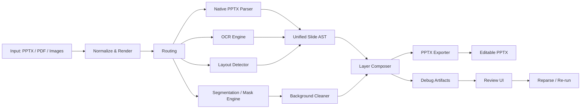

# 分层功能前沿研究与顶级架构优化方案

日期：2026-06-12

## 1. 目标

把当前“分层”模块升级为一条可持续演进的文档重建流水线：

1. 输入图片/PDF/PPTX
2. 结构理解
3. 文字恢复
4. 对象级分层
5. 干净背景修复
6. 可编辑 PPTX 导出
7. 前端复核与重跑

核心判断：

**最优解不是单一模型，而是“结构化流水线 + 多引擎路由 + 可复核工作流”。**

---

## 2. 前沿研究结论

### 2.1 PaddleOCR 3.x / PaddleOCR-VL

官方仓库与论文：

- [PaddleOCR](https://github.com/PaddlePaddle/PaddleOCR)
- [PaddleOCR-VL 论文](https://arxiv.org/abs/2510.14528)
- [PaddleOCR 3.0 Technical Report](https://arxiv.org/abs/2507.05595)

关键点：

1. PaddleOCR 3.0 形成了三件套：
   - `PP-OCRv5`：多语言 OCR
   - `PP-StructureV3`：层级文档解析
   - `PP-ChatOCRv4`：关键信息抽取

2. PaddleOCR-VL 是 0.9B 级别的文档解析 VLM，强调：
   - 多语言
   - 文本、表格、公式、图表
   - 页面级解析与元素级识别

3. 最新版本继续把重点放在：
   - 复杂区域优化
   - 区域级弱点修正
   - 结构化数据提取

对我们的启发：

1. OCR 不能只依赖单一 macOS Vision。
2. 解析层要走“页面级 + 元素级”双层结构。
3. 复杂区域要有置信度路由，而不是一刀切导出。

---

### 2.2 PP-DocLayout / DocLayout-YOLO

官方仓库：

- [DocLayout-YOLO](https://github.com/opendatalab/DocLayout-YOLO)

论文：

- [PP-DocLayout](https://arxiv.org/abs/2503.17213)
- [DocLayout-YOLO](https://arxiv.org/abs/2410.12628)
- [Advanced Layout Analysis Models for Docling](https://arxiv.org/abs/2509.11720)

关键点：

1. PP-DocLayout 强调统一布局检测，面向多种文档类型和 23 类常见版面元素。
2. DocLayout-YOLO 强调：
   - 实时
   - robust
   - diversity synthetic data
   - global-to-local adaptive perception
3. Docling 的研究说明：
   - 布局检测已经进入“更准 + 更快 + 更泛化”的阶段
   - 训练和评测需要明确工程 best practice

对我们的启发：

1. 当前规则网格检测必须升级为真正的布局检测器。
2. 文档解析要支持多类别，而不只是 text/image/shape。
3. 对 PPT 页面，布局检测比纯 OCR 更关键。

---

### 2.3 MinerU 生态

官方仓库：

- [MinerU](https://github.com/opendatalab/MinerU)
- [MinerU-Ecosystem](https://github.com/opendatalab/MinerU-Ecosystem)

关键点：

1. `VLM + OCR dual engine`
2. Markdown / JSON 结构化输出
3. 支持 PDF / Word / PPT / Images / Web pages
4. MCP / SDK / LangChain / LlamaIndex / Dify 集成完善
5. 支持 109 语言

对我们的启发：

1. 结构化中间层应该是系统的核心，而不是导出时临时拼接。
2. 工程上必须有 SDK / CLI / Agent / 服务端四层入口。
3. AI agent 不能直接碰底层细节，应该吃结构化 JSON。

---

### 2.4 SAM / SAM 2

官方仓库与论文：

- [SAM](https://github.com/facebookresearch/segment-anything)
- [SAM 2](https://github.com/facebookresearch/sam2)
- [SAM 2 paper](https://arxiv.org/abs/2408.00714)

关键点：

1. SAM 2 是 promptable segmentation 基础模型。
2. 支持 interactive prompt、box、mask。
3. 具备更强的实时性和更好的对象级分割能力。

对我们的启发：

1. 视觉元素分层不要只靠颜色差异。
2. 先 layout detect 再 SAM refine 更稳。
3. 人物、产品、图标、插画、按钮应该走对象 mask。

---

### 2.5 Qwen-Image-Layered / Qwen-Image-Edit

官方链接：

- [Qwen-Image-Layered](https://github.com/QwenLM/Qwen-Image-Layered)
- [Qwen-Image-Layered blog](https://qwen.ai/blog?id=qwen-image-layered)
- [Qwen-Image-Edit blog](https://qwen.ai/blog?id=qwen-image-edit)

关键点：

1. Qwen-Image-Layered 能把一张图拆成多个 RGBA 层。
2. 每层可独立编辑、移动、重着色。
3. 支持递归拆层，强调天然可编辑性。

对我们的启发：

1. “分层”不只是 PPT 对象层，也可以先在图像层把内容拆干净。
2. 对复杂视觉稿，应该先做 RGBA 层拆分，再导出 PPT 图层。
3. 图像编辑能力应当和 PPT 重建共享同一个图层表示。

---

### 2.6 LaMa

官方仓库：

- [LaMa](https://github.com/advimman/lama)

关键点：

1. 高分辨率 inpainting
2. 适合去除文字、物体并补背景
3. 与 mask 配合效果最好

对我们的启发：

1. 干净背景生成是必需组件。
2. 文字 mask + LaMa 是最稳的短期方案。
3. 对复杂背景，先用局部修复，不要全图重绘。

---

### 2.7 相关综述

- [Document Parsing Unveiled: Techniques, Challenges, and Prospects](https://arxiv.org/abs/2410.21169)
- [SCAN: Semantic Document Layout Analysis...](https://arxiv.org/html/2505.14381v1)

结论：

1. 文档解析正在从“模块拼接”走向“模块化流水线 + VLM 协同”。
2. 未来主流不是纯 end-to-end，而是可插拔的混合架构。
3. 复杂布局、高密度文本、跨页结构仍然是主要难点。

---

## 3. 顶级架构建议

### 3.1 总体架构

### 3.2 三层中间表示

建议将每页结果拆成三层数据：

1. `Observation Layer`
   - 原图、OCR 文本、检测框、mask、候选区域

2. `Semantic Layer`
   - 标题、正文、图注、表格、图标、背景、卡片、复杂区域

3. `Export Layer`
   - 文本框、shape、image、transparent image、background

这样前端和导出都不直接依赖某个模型的原始输出。

---

## 4. 推荐技术路线

### 4.1 路由策略

不同页面类型使用不同路径：

1. 文本密集页
   - PaddleOCR-VL / PP-StructureV3

2. 版面复杂页
   - DocLayout-YOLO / PP-DocLayout

3. 对象密集页
   - SAM 2 refine

4. 背景文字多、需要擦除页
   - LaMa / image editing model

5. 原生 PPTX
   - XML 直解 + 渲染校验

### 4.2 置信度分流

每页至少输出：

1. `editable_score`
2. `text_recovery_score`
3. `layout_recovery_score`
4. `unknown_node_ratio`

据此决定：

1. 可直接导出
2. 需要人工复核
3. 需要重跑 OCR
4. 需要重跑分层
5. 需要保底 raster 导出

### 4.3 工程分层

建议拆成五个服务/模块：

1. `ocr-engine`
2. `layout-engine`
3. `mask-engine`
4. `background-cleaner`
5. `pptx-exporter`

现有 Next.js 只负责：

1. 任务入口
2. 文件上传
3. 进度和结果展示
4. 导出下载

重模型和 Python 识别放到独立进程或本地服务。

---

## 5. 优化方案

### 第一阶段：打底

1. 接入 PaddleOCR 作为跨平台 OCR 主引擎。
2. 用 OCR bbox 生成文字 mask。
3. 用 LaMa/image2.0 生成干净背景。
4. 导出优先使用干净背景。

目标：

1. 解决“还是一张图”的问题。
2. 解决 Windows OCR 失效问题。

### 第二阶段：对象层

1. 用 DocLayout-YOLO / PP-DocLayout 做 layout detection。
2. 用 SAM 2 做对象 mask refine。
3. 人物、图标、产品图、插画拆成独立图层。

目标：

1. 从“文本分层”升级到“文本 + 视觉对象分层”。

### 第三阶段：结构层

1. 接入 PP-StructureV3 / MinerU JSON。
2. 优化标题、图表、表格、卡片、页脚等结构还原。
3. 建立页面 AST 统一层。

目标：

1. 复杂商业页、报告页、信息图页更像原稿。

### 第四阶段：前端复核

1. 真正的图层检查器。
2. 页面重跑按钮。
3. 导出模式切换。
4. 低置信度提示。
5. Debug 包下载。

目标：

1. 让用户能调、能改、能复核。

---

## 6. 你现在最该优先做的

按收益排序：

1. `PaddleOCR + 文字 mask + LaMa`。
   - 这是最直接能把结果从“图片”变成“可编辑 PPT”的路径。

2. `PP-DocLayout / DocLayout-YOLO`。
   - 这是把分层从“像素规则”变成“文档语义”的关键。

3. `SAM 2`。
   - 这是把视觉对象独立成层的关键。

4. `MinerU`。
   - 这是工程化、结构化和 agent 友好的参考。

5. `Qwen-Image-Layered`。
   - 这是把图像级编辑和分层能力统一起来的方向。

---

## 7. 结论

如果要做成顶级方案，不能只继续调规则。

正确的路线是：

1. 用 `PaddleOCR-VL / PP-StructureV3` 打通文档理解。
2. 用 `DocLayout-YOLO / PP-DocLayout` 做布局检测。
3. 用 `SAM 2` 做对象级 mask。
4. 用 `LaMa` 做背景修复。
5. 用统一 AST 连接前端复核和 PPT 导出。

这样最终得到的不是“图片转 PPT”，而是“可编辑文档重建平台”。

---

## 8. 补充前沿：更适合我们平台的 slide agent 与评测体系

### 8.1 PPTAgent

官方论文与仓库：

- [PPTAgent 论文](https://arxiv.org/abs/2501.03936)
- [PPTAgent GitHub](https://github.com/icip-cas/PPTAgent)

核心结论：

1. PPTAgent 不是直接生成整页图片，而是先分析参考幻灯片，再抽取功能类型和内容 schema。
2. 它采用“两阶段、编辑式”流程：先出大纲，再基于代码动作逐步生成和修改幻灯片。
3. 评测框架 `PPTEval` 把评价拆成 Content、Design、Coherence 三条线。

对我们的启发：

1. 工作台里的“风格确认阶段”应该更像参考页分析，而不是单纯 prompt 生图。
2. 工作流要保留“起草 -> 审核 -> 再生成”的闭环。
3. 评测不能只看美观，要看内容保真、结构一致性和可编辑性。

### 8.2 PreGenie

官方论文：

- [PreGenie 论文](https://arxiv.org/abs/2505.21660)

核心结论：

1. PreGenie 是一个 agentic + modular 的演示生成框架。
2. 它把流程拆成 `Analysis and Initial Generation` 与 `Review and Re-generation` 两阶段。
3. 它强调代码审查和页面审查都要存在，单靠代码审查不够。

对我们的启发：

1. 我们的工作台也应该引入“代码/结构审查 + 页面审查”的双审查机制。
2. 生成任务要支持失败页单独重跑，而不是整批重来。
3. 适合把“风格包”与“生成任务”绑定成可复核的任务流。

### 8.3 Talk-to-Your-Slides

官方论文：

- [Talk to Your Slides 论文](https://arxiv.org/abs/2505.11604)

核心结论：

1. 它明确指出，编辑幻灯片时直接操作图像像素不够稳。
2. 更高效的方式是直接操作底层对象模型或结构化数据。
3. 对于文本密集和批量编辑任务，它比 GUI 视觉代理更快、更便宜，也更稳定。

对我们的启发：

1. “分层”模块的核心不应该只是识别结果列表，而应该是结构化图层编辑器。
2. 我们的导入、编辑、导出应该共享同一份 Slide AST。
3. 对文本替换、批量修词、样式统一，这条路线比纯视觉路线更合适。

### 8.4 Docling

官方文档与仓库：

- [Docling 官网](https://www.docling.ai/)
- [Docling GitHub](https://github.com/docling-project/docling)

核心结论：

1. Docling 的定位是把混乱文档转成统一结构化表示。
2. 它支持 PDF、PPTX、DOCX、XLSX、HTML 等多格式输入。
3. 它强调 reading order、table structure、formula、image classification、local execution、MCP 和 agent 集成。

对我们的启发：

1. 我们的文档入口可以借鉴它的“统一文档表示”思路。
2. 对 PPTX / PDF / 图片包的处理不要是三套分支，而是统一进入结构层。
3. 在本机可部署、离线可运行、可接 agent 的方向上，Docling 的工程形态很值得借鉴。

### 8.5 Youtu-Parsing

官方仓库与论文：

- [Youtu-Parsing GitHub](https://github.com/TencentCloudADP/youtu-parsing)
- [Youtu-Parsing 论文](https://arxiv.org/abs/2601.20430)

核心结论：

1. 它把文档解析拆成感知、结构化和识别三个部分。
2. 它引入 NaViT 风格动态分辨率视觉编码器和 prompt-guided decoding。
3. 它强调并行解码，token parallelism 和 query parallelism 都能显著提速。

对我们的启发：

1. 如果后续接更重的解析模型，推理层要有并行解码和任务分片能力。
2. 我们的页面级解析可以把“阅读顺序恢复”单独作为一层，而不是附属字段。
3. 对大页、多对象、表格多的场景，速度和结构稳定性都比单纯 OCR 更重要。

### 8.6 评测基准

建议重点关注：

- [PPTBench](https://arxiv.org/abs/2512.02624)
- [UniPPTBench](https://arxiv.org/abs/2605.17356)
- [DECKBench](https://arxiv.org/abs/2602.13318)
- [PureDocBench](https://arxiv.org/abs/2605.07492)

结论：

1. PPT 评测不能只看“像不像”，要看理解、修改、设计、结构、跨源整合。
2. 多轮编辑、引用保真、版式一致性，是单次生成看不出来的问题。
3. 公共 benchmark 可能会饱和或有污染，所以平台必须有自己的金标页集和回归集。

---

## 9. 顶级架构的最终建议

建议把平台拆成五层：

1. `Control Plane`
   - 任务 schema 校验
   - agent / conversation 分流
   - 权限、限流、版本控制

2. `Parsing Plane`
   - Docling / PaddleOCR / Youtu-Parsing / DocLayout-YOLO / SAM 2 / LaMa
   - 输出统一的页面中间表示

3. `Document IR Plane`
   - Slide AST
   - reading order
   - layout graph
   - asset graph
   - style pack

4. `Execution Plane`
   - 生成
   - 编辑
   - 重跑
   - 导出

5. `Evaluation Plane`
   - 页面置信度
   - 结构一致性
   - 内容保真
   - 视觉质量
   - 内部 benchmark 回归

这套架构的核心不是“多接几个模型”，而是：

1. 先统一中间表示。
2. 再做任务路由。
3. 再做可复核执行。
4. 最后用评测体系约束回归。

---

## 10. 对当前平台的直接优化建议

1. 把“生成工作台”和“可编辑分层”继续拆成两条线，避免生成逻辑污染编辑逻辑。
2. 把“参考图分析”“风格包”“页面审核”“页面重跑”都改成任务级对象，而不是 UI 临时状态。
3. 新增页面级 artifact：
   - 原图
   - OCR JSON
   - layout JSON
   - mask
   - cleaned background
   - AST
   - 导出预览
4. 新增失败页重跑和批量重跑能力。
5. 建立一套内部 gold set，优先覆盖：
   - 商业汇报页
   - 产品页
   - 信息图页
   - 图文混排页
   - 多参考图风格确认页
