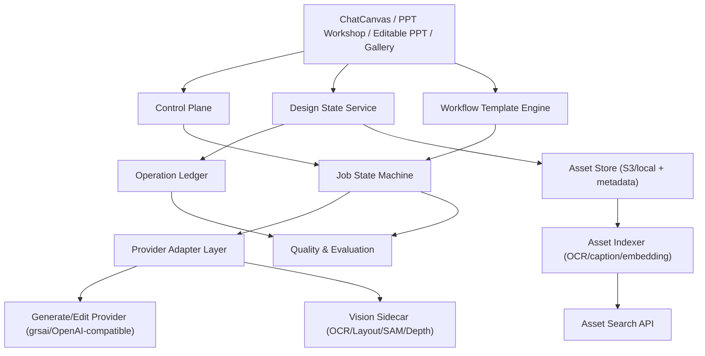

# 环中AIStudio 平台融合主计划（Master Plan）

版本：v2.0  
日期：2026-06-12  
定位：全平台唯一执行口径（Single Source of Truth）

---

## 1. 文档目标

这份文档用于融合已有多个“平台规划 + 前沿调研 + 模块方案”，并统一为一套可执行路线。  
覆盖范围：

1. ChatCanvas 主画布与图像编辑链路（生成/扩图/局部重绘/去背/高清/分层）。
2. 提示词、案例、风格包、技能、图库/灵感库/参考库。
3. PPT 工作台与“可编辑分层”模块。
4. 内部 Agent 工作台、任务模板、任务恢复与知识库联动。
5. 任务状态机、错误分级、质量评估、发布与回归体系。

---

## 2. 融合来源与映射关系

| 来源文档 | 核心贡献 | 本文落位 |
|---|---|---|
| `PLATFORM_ENHANCEMENT_PLAN_V2.md` | PPT 工作台现状、并发和审核改造、任务恢复方向 | 第 4、7、9 节 |
| `AI_DESIGN_PLATFORM_FRONTIER_REPORT_2026-06-12.md` | 前沿技术雷达、阶段路线、数据/API抽象 | 第 5、6、7、10 节 |
| `INTERNAL_AGENT_WORKBENCH_PLAN.md` | 内部 Agent 原则、能力检测、任务拆解与恢复 | 第 6、7、8 节 |
| `EDITABLE_PPT_TECH_PLAN.md` | 可编辑PPT 的 V1/V2/V3 工程分期 | 第 7、8、9 节 |
| `EDITABLE_PPT_LAYERING_OPTIMIZATION_PLAN_2026-06-12.md` | 分层优化路径（OCR/Mask/背景修复/复核） | 第 7、9 节 |
| `EDITABLE_PPT_LAYERING_GITHUB_RESEARCH_2026-06-12.md` | GitHub 可借鉴实现与可落地短期动作 | 第 6、7、9 节 |
| `EDITABLE_PPT_FRONTIER_RESEARCH_AND_ARCHITECTURE_2026-06-12.md` | 顶级架构、IR分层、评测体系 | 第 5、8、10 节 |
| `IMAGE2_OPEN_SOURCE_DESIGN_TOOLS_RESEARCH.md` | 案例中心/风格包/任务队列/Agent 工具化建议 | 第 6、7、8 节 |
| `INPAINT_SMART_SELECTION_DEV_PLAN_2026-06-12.md` | 智能选区交互与 mask 管线统一方案 | 第 7、9 节 |

---

## 3. 冲突裁决与统一决策（Keep / Merge / Drop）

### 3.1 Keep（直接保留）

1. 渐进改造，不推倒重来（保留 Next.js + Supabase 主体）。
2. 非破坏式编辑默认化（operation/version 历史完整保留）。
3. “可编辑优先，图片兜底”的分层策略。
4. 内部 Agent 优先，不做对外插件市场。
5. 多阶段可独立交付，先可用再高保真。

### 3.2 Merge（合并执行）

1. `PPT 工作台路线` 与 `可编辑PPT路线` 合并为双轨：
   - 轨道 A：风格确认 -> 批量美化 -> 审核导出（生产效率）。
   - 轨道 B：导入解析 -> 分层重建 -> 可编辑导出（编辑能力）。
2. `智能选区方案` 与 `局部精修方案` 合并为单一交互流：
   - 不强制模式切换；
   - 点击/框选/补涂最终统一到 `effectiveMask`。
3. `资产库改造` 与 `视觉检索路线` 合并：
   - 先元数据索引，再向量索引；
   - 再做以图搜图/风格推荐。

### 3.3 Drop（暂不执行）

1. 多模型对比面板（按用户要求明确不做）。
2. 一开始引入重型多服务（Redis + 多进程编排）作为强依赖。
3. 追求全量 PSD 级 100% 结构恢复。
4. 直接复制 AGPL 项目实现（仅借鉴交互与架构思路）。

---

## 4. 平台愿景与北极星指标

### 4.1 产品愿景

从“AI 生图工具集合”升级为“可生产、可追溯、可复用、可协作的设计生产平台”。

### 4.2 北极星指标（NSM）

1. 单项目从输入需求到可交付结果的总时长（TTV）下降 >= 40%。
2. 编辑动作可回退覆盖率 100%。
3. 长任务恢复成功率 >= 95%。
4. 审核通过前的人均返工轮次下降 >= 30%。

---

## 5. 统一架构总览（平台级）

架构原则：

1. 交互状态、提交状态、历史状态三层分离。
2. 所有 AI 操作都写入 `operation ledger`。
3. 模型能力外接必须可降级（sidecar 缺失不阻断主流程）。

---

## 6. 能力模块统一地图

1. 画布编辑域：`generate / inpaint / outpaint / process / history`。
2. 资产与检索域：图库、灵感库、参考库、标签、案例中心、风格包、视觉检索。
3. 提示词与技能域：原子词、组合包、模板、版本、使用日志、技能工作流。
4. PPT 生产域：风格确认、批量美化、审核、导出、可编辑分层重建。
5. Agent 与流程域：能力检测、内部 Agent 中心、任务模板、执行看板。
6. 基础设施域：任务状态机、错误分级、质量评估、回归测试、监控日志。

---

## 7. 融合后的阶段路线（统一 roadmap）

## Phase 0（1-2 周）：稳定性与状态统一

目标：先把平台“跑稳、可恢复、可定位”。

交付：

1. 全局任务状态机统一为 `queued/running/completed/failed/cancelled`。
2. 错误分类统一（参数错误、网络超时、429、5xx、审核失败、未知错误）。
3. 刷新恢复机制统一（含画布任务与 PPT 批量任务）。
4. 回归基线建立（生成、扩图、局部重绘、PPT 批量、导出）。

验收：

1. 刷新后任务恢复成功率 >= 95%。
2. 聊天区失败噪音下降 >= 80%。

## Phase 1（2-4 周）：编辑底座与智能选区可用化

目标：修复并升级局部精修，做到“默认好用”。

交付：

1. 智能选区统一到 `baseSmartMask + manualDeltaMask + effectiveMask`。
2. 点击/框选/补涂统一提交链路，预览与提交一致。
3. 扩图/去背/高清/局部重绘统一 operation 记录。
4. 前后对比与可视历史上线。

验收：

1. 编辑回退覆盖率 100%。
2. 常见对象一次选区成功率 > 80%。
3. 手工补涂始终可用，不依赖模式切换。

## Phase 2（3-5 周）：资产系统与视觉检索 MVP

目标：图库升级为“可生产资产库”。

交付：

1. 资产索引任务（caption/OCR/embedding/metadata）首版。
2. 以图搜图、相似风格检索、构图检索首版。
3. 案例中心 + 风格包 + 提示词资产打通。
4. 检索结果可回填到画布和 PPT 工作台。

验收：

1. 10k 资产索引命中检索 < 300ms。
2. 用户可从当前图快速找到相似参考并复用。

## Phase 3（4-6 周）：PPT 双轨增强

目标：效率轨和编辑轨同时成立。

交付：

1. 轨道 A（生产效率）：风格确认 -> 自动美化 -> 审核 -> 导出持续优化。
2. 轨道 B（可编辑重建）：OCR + mask + cleaned background + 可编辑文本层。
3. 页级 debug 包（原图、OCR、mask、background、AST、导出预览）。
4. 失败页单独重跑与置信度标记。

验收：

1. 40 页项目总耗时下降 >= 35%。
2. 审核首次可见方案 <= 10s。
3. 图片/PDF 输入下文字恢复跨平台可用（Windows/Mac）。

## Phase 4（4-8 周）：Agent 与模板化执行

目标：把重复动作沉淀为可执行模板。

交付：

1. 内部 Agent 中心联动真实任务，不做“空聊天”。
2. 高价值模板首版（海报、KV、提案封面、PPT 批量美化）。
3. 执行看板（状态、失败重试、人工接管）。
4. NAS/飞书知识状态可见，并可作为上下文输入。

验收：

1. 高频任务可一键启动模板流程。
2. 任务可追踪、可恢复、可人工接管。

## Phase 5（中期）：前沿能力外接

目标：增强难例处理能力与结构化能力。

交付：

1. Vision sidecar 模块化接入（PaddleOCR/PP-Structure/SAM2/DocLayout）。
2. 分层从规则升级为“layout detect + mask refine + AST merge”。
3. 文本严格模式与 layout spec 中间层落地。

验收：

1. 难例页面给出可解释输出与低置信提示。
2. 返工轮次持续下降。

---

## 8. 统一数据与接口方向

短期不破坏现有 `image_records`，采用增量新增：

1. `design_assets`：图片/mask/layer/reference/export/ppt_page。
2. `design_operations`：输入输出资产、operation kind、model、params、status、error。
3. `asset_index_jobs`：索引状态、耗时、失败原因。
4. `ppt_parse_jobs`：页级解析状态、置信度、可重跑标记。

接口增量建议：

1. `POST /api/design-operations`（统一操作记录入口）。
2. `POST /api/design-operations/:id/retry`（失败重试）。
3. `POST /api/asset-index`、`POST /api/asset-search`。
4. `POST /api/vision/segment`、`POST /api/vision/layout`（可选 sidecar）。
5. `POST /api/editable-ppt/jobs/:id/pages/:page/reparse`。

---

## 9. 未来两期冲刺（可直接执行）

## Sprint 1（本期，7 天）

目标：修稳定 + 修交互 + 建统一账本。

任务：

1. 局部精修交互修复：
   - 恢复补涂；
   - 修复点击/框选命中；
   - 统一 `effectiveMask` 提交链路。
2. 全局任务状态机和错误码统一（画布 + PPT）。
3. `design_operations` 最小落地（generate/inpaint/outpaint/process）。
4. PPT 任务刷新恢复与失败项重试入口。
5. 回归用例首版（关键链路冒烟）。

验收 KPI：

1. 局部精修“可选 + 可涂 + 可提交”成功率 >= 95%（内部样本）。
2. 刷新恢复成功率 >= 95%。
3. 失败可定位率 >= 90%。

## Sprint 2（下期，7 天）

目标：把资产和审核做成闭环。

任务：

1. 资产索引与搜索 API MVP（先 metadata + OCR，embedding 可后置到异步）。
2. 审核中心对照升级（原稿/当前方案双栏 + 快捷重生）。
3. 风格包与案例中心联动 PPT 风格确认。
4. 工作流模板首版（至少 2 条）。
5. 指标看板首版（耗时、成功率、失败分布、返工轮次）。

验收 KPI：

1. 检索可用率 >= 95%。
2. 审核首屏可见时间 <= 10s（并发场景）。
3. 模板任务一键启动成功率 >= 90%。

---

## 10. 量化指标体系（平台级）

1. 可用性：关键功能可执行率 >= 99%（本地模式）。
2. 可恢复性：任务恢复成功率 >= 95%。
3. 可回退性：编辑操作可回退覆盖率 100%。
4. 效率：端到端产出时长下降 >= 35%（标准项目集）。
5. 质量：审核通过前返工轮次下降 >= 30%。
6. 选区质量：对象级一次选区成功率 > 80%。
7. 资产效率：10k 规模检索命中延时 < 300ms（索引路径）。

---

## 11. 风险清单与控制策略

1. 状态继续耦合导致回归频发。  
控制：所有编辑入口必须经过 `effectiveMask` / `operation` 统一中间层。

2. 前沿模型接入引发环境不稳定。  
控制：sidecar 可选，缺失时自动降级到本地规则链路。

3. 接口漂移导致前后端错位。  
控制：新增 API 必须定义 schema 与示例 payload。

4. 任务量上来后失败不可恢复。  
控制：任务分段、页级重跑、失败项重排队。

5. 文档多版本并行导致执行偏航。  
控制：本文件为唯一执行口径，其他文档只作参考输入。

---

## 12. 文档迁移与治理

### 12.1 文档角色重定义

1. `PLATFORM_GLOBAL_DEVELOPMENT_BLUEPRINT_2026-06-12.md`（本文）：
   - 角色：唯一主计划（执行口径）。
2. 其他文档：
   - 角色：专项输入与背景论证（参考）。

### 12.2 使用规则

1. 新需求先映射到本文 Phase/Sprint，再开工。
2. 专项文档若与本文冲突，以本文为准。
3. 每周迭代结束后仅更新本文 KPI 和 Sprint 进度，避免多文档漂移。

---

## 13. 立即执行建议（48 小时）

1. 先完成 Sprint 1 的局部精修可用性修复（选中+补涂+提交一致）。
2. 同步落地 `design_operations` 最小记录，保证后续排障可追踪。
3. 补齐 PPT 刷新恢复和失败重试入口，避免批量任务中断损失。

---

## 14. 执行进度快照（2026-06-12）

### 14.1 已完成

1. 局部重绘交互主链路修复：
   - 智能选区 + 手工补涂融合；
   - 点击/框选/补涂统一提交到 `effectiveMask`。
2. `design_operations` 追踪最小落地：
   - `generate / image-process / inpaint` 均返回 `operationId`；
   - 成功/失败状态回写完成。
3. 统一操作追踪模块抽取：
   - 新增 `src/lib/design-operation-tracker.ts`；
   - 清理三条 API 路由重复实现。
4. 错误分级首版：
   - 新增 `src/lib/operation-error.ts`；
   - 三条核心链路统一返回 `error + errorCode + retryable`。
5. 回归清单首版：
   - 新增 `docs/SPRINT1_REGRESSION_CHECKLIST_2026-06-12.md`。
6. 批量任务状态统一与恢复增强：
   - `BatchSnapshot` 新增 `unifiedStatus + recovery`；
   - `/api/batches/*` 增加归属校验与错误分级返回；
   - 服务重启后 `*_generating` 页面自动恢复到 `*_queued` 并继续入队。
7. PPT 工作台接口错误语义统一：
   - `import / export / verify-text` 接口已接入统一错误分级返回。
8. Sprint 1 自动化冒烟脚本：
   - 新增 `scripts/smoke-sprint1.sh`，用于校验关键错误返回契约（`error/errorCode/retryable`）。

### 14.2 进行中

1. Phase 0：任务恢复状态机统一（画布 + PPT 批量任务细化）。
2. 批量任务 API 权限校验与错误分级统一（`/api/batches/*`）收尾联调。
3. Phase 2：资产索引与检索 MVP（metadata-first）已完成 API 首版，进入联调与 UI 接入阶段。

### 14.3 未开始

1. 审核中心对照升级（原稿/当前方案双栏 + 快捷重生）。
2. 风格包与案例中心联动 PPT 风格确认。
3. 工作流模板首版（至少 2 条）。

### 14.4 新增完成（2026-06-12）

1. 新增 `POST/GET /api/asset-index`：
   - 本地模式支持立即执行索引任务（`full/project/ids`）；
   - 索引来源支持 `design_assets + image_records`；
   - 返回任务状态与统计（`sourceCount/indexedCount/skippedCount/failedCount`）；
   - `force=false` 时支持增量跳过（依据 source 指纹与更新时间）。
2. 新增 `POST/GET /api/asset-search`：
   - 支持 query + 过滤检索（project/sourceType/kinds/models/sizes/tags）；
   - 支持 relevance/recent 两种排序；
   - 支持 facets 聚合返回（models/sizes/tags/kinds/projects）。
3. 本地后端新增资产索引数据结构：
   - `asset_index_entries`（索引条目）；
   - `asset_index_jobs`（索引任务）。
4. 新增资产索引类型定义：
   - `AssetIndexEntry`；
   - `AssetIndexJob`。
5. 冒烟脚本扩展：
   - 新增 `asset-index` 错误路径校验；
   - 新增 `asset-index` 成功路径校验；
   - 新增 `asset-search` 正常路径与过滤参数校验。
6. 资产面板前端接入首版：
   - 新增“素材库 / 索引检索”双视图切换；
   - 支持一键索引、检索结果网格/列表预览；
   - 支持从检索结果直接“导入参考图 / 加到画布 / 生成提示词”；
   - 新增索引任务列表面板（状态/耗时/失败详情 + 运行中自动轮询）；
   - 新增排序控件与 facet 点选回填（标签/模型）。
